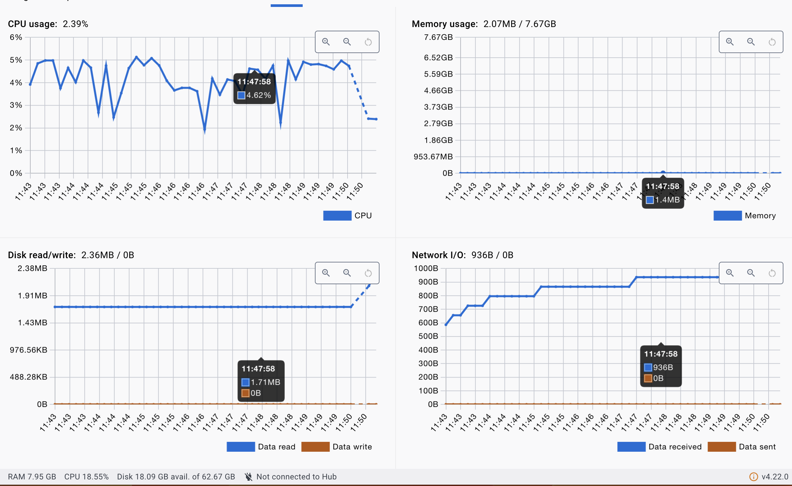
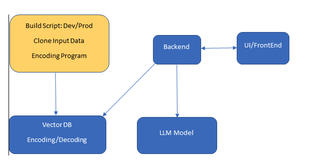
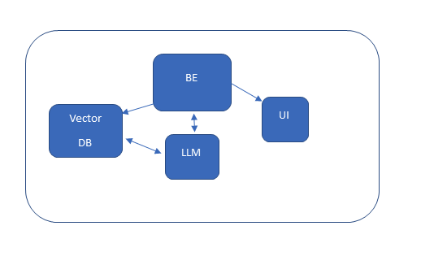

# LLM Documentation

---

Also Cisco Prior work: (https://blogs.cisco.com/networking/transforming-customer-experience-with-cisco-ai-chatbots)

---


## How to Use

Model link: https://huggingface.co/TheBloke/Llama-2-7B-GGML/blob/main/llama-2-7b.ggmlv3.q4_0.bin 
(looking into automating with wget)

```
docker-compose up --build
```


```
cd backend
mkdir llm
cd llm
mv modelfile
```
### Install requirements
It is recommended to create a virtual-env before installing dependencies. Or use a dependency manager such as anaconda.
Ex.

```
python -m venv venv_name
source venv_name/bin/activate
```

```
pip install -r requirements.txt
```

### Run the Docker image from Dockerfile
```
docker pull ankane/pgvector
docker run ankane/pgvector -p 5432:5432 -e POSTGRES_PASSWORD=secret POSTGRES_USER=postgres
```

### CPU/Memory of container


### Training Pipeline 
---
```
cd training
python scrape.py
python embeddings.py
python db-embeddings.py
```

### Start the backend
---
```
cd backend/inference
python main.py
```

### Load UI (html)
---
Resides in UI directory


### Contents:
1. [Introduction](#intro)
2. [Requirements](#requirements)
3. [Training Infra Components](#training)
4. [Serving Infra Components](#serving)
5. [Guardrails](#guardrails)
6. [PDF Docs of Release](#pdf-docs-of-release)
7. [Open Source Model / Finetuning](#open-source-model--finetuning)
8. [Vector DB for Semantic Search](#vector-db-for-semantic-search)
9. [Deployment](#deployment)
10. [Resources](#resources)

---

### 1. Introduction <a name="intro"></a>
The goal is to make Cisco documentation available via an LLM model and the model responds via APIs for On-prem products.
### 2. Requirements <a name="requirements"></a>
- Documents will be stored in a HTML/PDF/.adoc format on an internal server
- Python / Flask server for backend
- Sentence-transformer embeddings / could create custom using Google's sentencepiece (https://github.com/google/sentencepiece) which this repo currently leverages.
- UI will use React Framework
- VectorDB of embeddings will be using Pgvector

### 3. Training Infrastructure <a name="training"></a>



### 4. Serving Infrastructure <a name="serving"></a>



### 5. Guardrails <a name="guardrails"></a>
- Needs to have guardrails.
- Ensure that LLM does not stray from target domain.

### 6. PDF Docs of Release <a name="pdf-docs-of-release"></a>
- Documentation provided in PDF format.
- Documentation can also be provided in pure text or .adoc format.
- Idea of garbage in garbage out -> data must be transformed into a Q/A format (only if training / finetuning)
- If using semantic search, phrases can be queried from the DB

### 7. Open Source Model / Finetuning <a name="open-source-model--finetuning"></a>
- Use Open Source Model. (Ideally Llama-7B-Chat-Q4
- Finetune the model using LoRa to match Cisco Docs and Vocabulary.
- LangChain can be used to bridge the workflow

### 8. Vector DB for Semantic Search <a name="vector-db-for-semantic-search"></a>
- Incorporate Vector DB.
- Allows for no retraining necessary between releases.
- Makes documents queriable using cosine similiarity between embeddings.
- Open source embedding algorithms available, no need to use OpenAI

### 9. Deployment <a name="deployment"></a>
- Utilize Docker containers for the inference build.
- Deployment will be made to Kubernetes clusters.

### 10. Resources <a name="resources"></a>
- https://github.com/antimetal/awsdocsgpt
- https://github.com/ShreyaR/guardrails
- https://github.com/facebookresearch/llama-recipes#multiple-gpus-one-node
- https://arxiv.org/abs/2305.07759
- https://github.com/karpathy/llama2.c
- https://github.com/neuml/txtai
